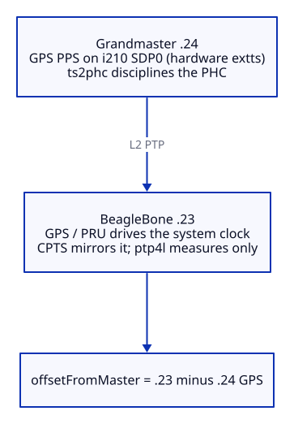

# Cross-validating the clock against an independent PTP grandmaster

This documents how the BeagleBone's clock is cross-validated against a separate GPS
PTP grandmaster on the LAN: measuring their time agreement with hardware timestamps,
without disciplining either clock to the other. Each box keeps its own GPS as the
authority; PTP is used only as a measuring instrument. The goal is to bound accuracy
against an independent reference. For this clock's **internal precision** (offset and
jitter against its own PPS), see [docs/measurements.md](docs/measurements.md). The
service and script referenced below live in [`measurement/`](measurement/).

## The reference grandmaster

The grandmaster's GPS PPS is wired into an **Intel i210 SDP pin (SDP0) configured as an
external timestamp input (`extts`)**, so every pulse is latched in the i210's silicon
against the NIC's PHC. A `ts2phc` daemon disciplines the i210 PHC to those hardware
captures, and `ptp4l --masterOnly` serves it. The grandmaster is therefore a
hardware-timestamped, nanosecond-class GPS reference, so any microsecond-scale result
below reflects the BeagleBone cpsw measurement floor, not the grandmaster.

## The idea

The trick is to repurpose the BeagleBone's otherwise-idle Ethernet timestamp clock
(CPTS, exposed as `/dev/ptp0`) as a measuring stick:

1. The system clock stays GPS and PPS driven through the PRU path. It is the
   authority and nothing here touches it.
2. `phc2sys` disciplines the idle CPTS PHC from that GPS-driven system clock, in the
   TAI scale, so CPTS becomes a faithful mirror of this box's GPS time. This only
   writes the PHC; it never writes the system clock.
3. `ptp4l` runs as a free-running client of the grandmaster. `free_running` means it
   measures the offset to the master and reports it, but never disciplines anything.

With CPTS equal to our GPS time, `ptp4l`'s `offsetFromMaster` is literally our GPS time
minus the grandmaster's GPS time, taken with NIC hardware timestamps on both ends.
Neither clock is steered toward the other; we are only reading the difference.



## Why the median, not the mean

The AM335x cpsw timestamping is the weak link here, which is the whole reason this
project uses the PRU and not cpsw for the real clock. The per-sample PTP offset is
positive-skewed and wanders by about 15 us over tens of seconds, with a mean path
delay around 17 us. That is measurement noise on the BeagleBone side, not clock
divergence: `phc2sys` holds CPTS to within about 1 us of the system clock, and the
grandmaster's i210 PHC is held tight by its SDP hardware capture.

So a single reading is misleading. `ptp-agreement.sh` samples once per second over a
roughly one-minute window and reports the **median**, which is stable and centers near
zero, plus the spread so you can see the cpsw noise floor.

## Calibration: the path is symmetric, leave delayAsymmetry at 0

PTP assumes the forward and reverse path delays are equal. If they are not, the offset
is biased by half the asymmetry, and you would correct it with `delayAsymmetry` in
`ptp4l.conf`. We checked. Over a 60 sample window the **median offset is sub-microsecond**
(for example -353 ns and +1182 ns on two runs), so there is no significant asymmetry to
remove. `delayAsymmetry` stays 0.

A warning worth stating: do not calibrate `delayAsymmetry` to the *mean*. The mean is
pulled up by the skewed cpsw noise tail (around +1 to +2 us). Setting an asymmetry to
cancel that would inject a real bias into a measurement that is actually centered on
zero. Calibrate against the median, and here the median says the path is symmetric.

## Result

Measured this way, this BeagleBone and the Intel i210 plus u-blox NEO-M9N grandmaster,
each on its own GPS, **agree to within about 1 to 2 us (median)**. The grandmaster is
SDP hardware-timestamped and nanosecond-class, so essentially all of that floor, the
~15 us spread and the ~17 us mean path delay, originates on the BeagleBone cpsw side.
The PRU-disciplined system clock is itself nanosecond-class; cpsw cannot resolve the
comparison any finer, so the measured 1 to 2 us is an upper bound on the disagreement,
not a measurement of it.

## Files

- `measurement/cpts-phc2sys.service` disciplines `/dev/ptp0` (CPTS) from the GPS-driven
  system clock in the TAI scale. Install and enable it so the measurement reference is
  always available.
- `measurement/ptp-agreement.sh` on-demand readout. Samples `ptp4l` and prints the median offset
  (the agreement), the spread, and the path delay. Run it when you want a number; it
  does not log anything in the background.

The `ptp4l` side is the stock service already used on this box, configured as a
free-running L2 client:

```
# /etc/linuxptp/ptp4l.conf
[global]
clientOnly        1
domainNumber      0
network_transport L2
time_stamping     hardware
```
```
ExecStart=/usr/sbin/ptp4l -i eth0 -m -s -H --free_running 1
```

## Reproduce it

Requirements: a GPS PTP grandmaster reachable on the same L2 segment and PTP domain
(here, `ptp4l --masterOnly` on an i210 whose PPS is captured on SDP0 as `extts` and fed
to the PHC by `ts2phc`, L2 transport, domain 0), and a NIC on this box with PTP
hardware timestamping (`ethtool -T eth0` should list `hardware-transmit`,
`hardware-receive`, and the `ptpv2-event` filter).

```bash
# 1. ptp4l as a free-running client of the grandmaster (measure only)
sudo systemctl enable --now ptp4l        # using the config above

# 2. Mirror this box's GPS time onto the idle CPTS PHC (measurement reference)
sudo install -m 0644 measurement/cpts-phc2sys.service /etc/systemd/system/
sudo systemctl daemon-reload
sudo systemctl enable --now cpts-phc2sys.service

# 3. Read the agreement on demand
sudo install -m 0755 measurement/ptp-agreement.sh /usr/local/sbin/
sudo ptp-agreement.sh            # ~60s, prints the median offset vs the grandmaster
```

Interpreting the output: `median offset` is the agreement between the two GPS clocks.
Expect it within a couple of microseconds. If you see a seconds-scale number, the
`cpts-phc2sys` reference is not running (CPTS is free-running). If you see a constant
near 37 s, CPTS is being held in UTC instead of TAI; the service uses `-O 37` to avoid
that.
