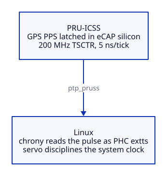

# PRU PPS: a nanosecond-precision GPS Stratum 1 clock on the BeagleBone Black

Turn a BeagleBone Black and a GPS module with a PPS output into a **Stratum 1 NTP
server** whose time is disciplined to **nanoseconds**, by capturing the GPS
pulse-per-second edge in **PRU hardware** instead of through a Linux GPIO interrupt.
The PRU-ICSS latches every PPS edge with the 200 MHz IEP timer, a small real-time
daemon feeds it to **chrony** over shared memory, and the result is a self-hosted GPS
reference clock with none of the interrupt-latency jitter that limits the usual
`pps-gpio` approach.

It is also independently cross-validated. Measured over hardware-timestamped **PTP**
against a separate Intel i210 plus u-blox NEO-M9N grandmaster, this clock agrees with a
second, fully independent GPS reference to within a couple of microseconds. See
[CROSS-VALIDATION.md](CROSS-VALIDATION.md) for the methodology and how to reproduce it.

## Performance Results

By entirely bypassing the Linux GPIO IRQ pathway and capturing the pulse edge using the 200 MHz PRU Industrial Ethernet Peripheral (IEP) hardware timer, this implementation eliminates traditional interrupt latency jitter.

- **Daemon Precision:** Typical wall-time residuals of 100 to 800 ns vs the true PPS edge.
- **System Clock Offset:** Once the Chrony servo converges, `chronyc tracking` reports system time offsets in the **low nanosecond domain** (often under ±10 ns).
- **Jitter Profile:** The estimated standard deviation converges to ~1 ns, an order of magnitude better than standard `pps-gpio`, which routinely shows 5 to 20 µs of offset dispersion.

Detailed tracking data and logs can be found in the [Measurements & Validation](docs/measurements.md) document.

### Cross-validation against a PTP grandmaster

Precision is not the same as accuracy, so the clock is checked against a second,
independent GPS reference. Using the BeagleBone's idle CPTS Ethernet timestamp clock as
a measuring instrument (disciplined to this box's GPS, while `ptp4l` runs free-running
and measures only), the system is compared over hardware-timestamped PTP to an Intel
i210 plus u-blox NEO-M9N grandmaster, whose own GPS PPS is hardware-captured on an i210
SDP pin (`extts`) and disciplined into the NIC PHC by `ts2phc`. Neither clock is
disciplined to the other; each keeps its own GPS.

The two independent GPS clocks **agree to within about 1 to 2 µs (median)**. Since the
grandmaster is SDP hardware-timestamped and nanosecond-class, that floor is set by the
AM335x cpsw timestamping, not by the clocks, which is precisely why this project drives
the real clock from the PRU and not from cpsw. Full methodology and a reproduction
recipe are in [CROSS-VALIDATION.md](CROSS-VALIDATION.md).

## Documentation

1. **[Architecture & Overview](docs/architecture.md)**: What is a PRU, why use it for PPS, and the system architecture
2. **[Hardware Requirements](docs/hardware.md)**: Supported hardware, GPS modules, and prerequisites
3. **[Initial Setup & Overlays](docs/setup.md)**: `uEnv.txt` configuration and device tree overlays
4. **[PRU Firmware](docs/firmware.md)**: Compiling and installing the PRU microcontroller firmware
5. **[Userspace Daemon & Chrony](docs/daemon.md)**: Building the shared memory daemon and configuring Chrony
6. **[Verification & Troubleshooting](docs/verification.md)**: Checking system behavior, remoteproc state, and common issues

### Deep Dives

7. **[Timestamp Model](docs/timestamp-model.md)**: What exactly is captured, which edge, what defines t=0
8. **[Clock Domains & Synchronization](docs/clock-domains.md)**: IEP to wall correlation, memory mechanism, ordering guarantees
9. **[Measurements & Validation](docs/measurements.md)**: Expected performance, real-world tracking/statistics, and diagnostic guidance

## Source Code

- [Firmware (`firmware/`)](firmware/): PRU0 C source, resource table, INTC map, linker command
- [Daemon (`daemon/`)](daemon/): Userspace SHM bridge, RT priority tuning, and systemd services
- [Overlays (`overlays/`)](overlays/): Device tree overlays for pinmux and rpmsg
- [Tools (`tools/`)](tools/): Log parsing and statistics helpers
- [Measurement (`measurement/`)](measurement/): phc2sys service and agreement script for the PTP cross-validation ([CROSS-VALIDATION.md](CROSS-VALIDATION.md))
