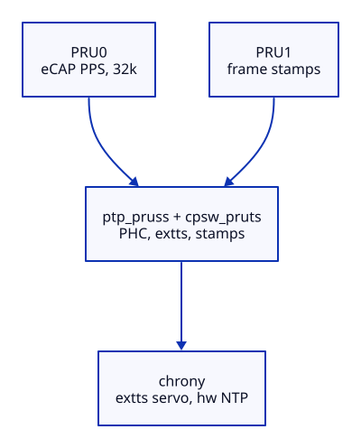

# Architecture & Overview

## What is a PRU?

The Programmable Real-Time Unit (PRU) subsystem on the AM335x contains two 200-MHz microcontrollers that run completely independently of the main ARM CPU and the Linux kernel. They are configured, loaded with firmware, and booted from userspace via the Linux **remoteproc** framework.

Because PRUs do not run an operating system or handle interrupts in the traditional sense, their execution is deterministic and strictly real-time. They can poll pins, manipulate hardware registers, and interact with peripherals at cycle-accurate precision (5 ns per instruction). This project uses both of them.

## Why not GPIO PPS?

The standard Linux GPIO PPS driver (`pps-gpio`) timestamps the PPS edge in a GPIO interrupt handler. While better than serial PPS, it still goes through the interrupt subsystem, yielding roughly 20 µs dispersion with 10 µs+ outliers under normal system load.

Here the PPS edge never touches software at all: the ICSS **eCAP capture unit** latches it in silicon (CAP1, rising) against the free-running 200 MHz TSCTR counter. PRU0 only does the bookkeeping around the hardware capture and forwards `{seq, ticks}` to the ARM. The same counter, extended to 64 bits and exposed as a PTP hardware clock by the `ptp_pruss` kernel module, is the single timebase for everything on this box.

## Component roles

- **eCAP (silicon)** latches the PPS edge; **PRU0** forwards captures over rpmsg and also counts the DS3231's 32.768 kHz output as an independent temperature-compensated frequency reference.
- **PRU1** polls the cpsw MAC statistics and latches the shared TSCTR for **every frame on the wire**, writing `{count, ticks}` entries into a shared ring: hardware packet timestamps for a MAC that cannot stamp NTP on its own.
- **`ptp_pruss` (kernel)** exposes the extended TSCTR as a PHC (`/dev/ptpX`): phase settable (placed at TAI at boot), frequency trimmable (the daemon holds it on GPS), and the PPS capture surfaces as **extts channel 0**.
- **`cpsw_pruts` (kernel)** matches PRU1's ring entries to skbs and delivers them through the standard kernel timestamping API, so chrony and ptp4l see ordinary hardware timestamps.
- **`pru_pps_shm` (daemon)** is the calibrator: least-squares fits of ticks against the system timeline, per-pulse qErr subtraction, DS3231 tempco learning (feeds chrony's `tempcomp` and the PHC holdover trim), PHC frequency trim, and Prometheus textfile metrics. It still writes the legacy SHM refclock as a **witness**.
- **chrony** is servo and policy. The selected reference is the PPS via **PHC extts**: chrony pairs the hardware capture with its own PHC-system model, so no userspace clock model sits in the reference path. It serves NTP with hardware RX/TX timestamps from the PRU1 ring.

## Why extts instead of SHM?

Projecting a pulse into `CLOCK_REALTIME` in userspace necessarily models chrony's own steering, and letting chrony consume that model closes a feedback loop: under CPU load the model lags, chrony steers toward the lagged sample, and the loop rings at microsecond scale. Handing chrony the raw hardware capture on the PHC dissolves the loop; the extts path holds ~90 ns RMS through a full-CPU torture test. The SHM feed stays configured `noselect` as a witness, so both paths remain comparable in the logs.

### Deep dives

- [Timestamp Model](timestamp-model.md): what exactly is captured and what defines t=0
- [Clock Domains](clock-domains.md): how ticks are correlated with system time
- [Measurements](measurements.md): expected performance numbers and how to reproduce

[Next: Hardware Requirements](hardware.md)
